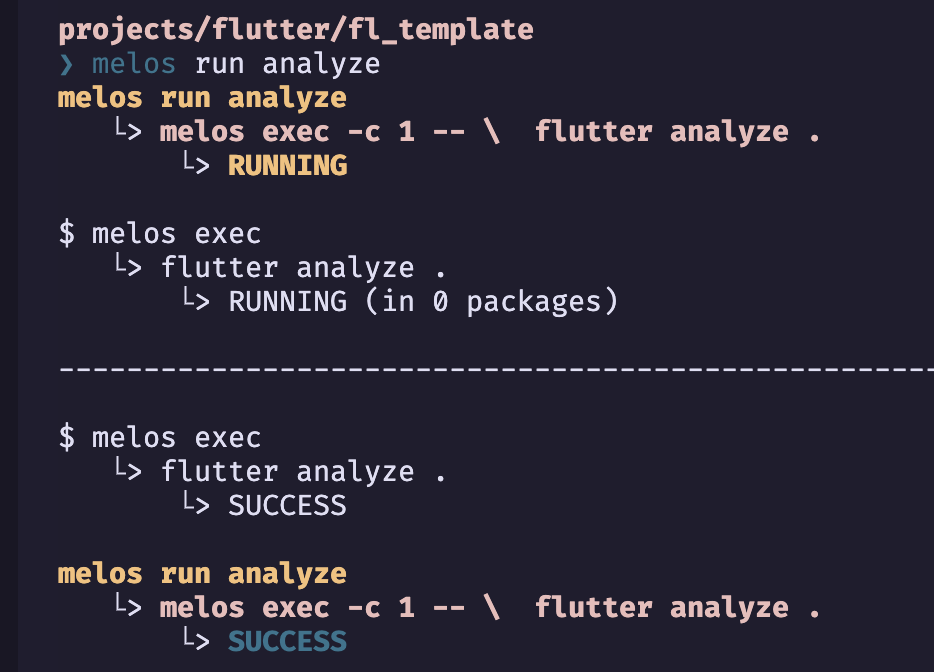

## Melos Setup

[Melos' Getting Started](https://melos.invertase.dev/getting-started)

To set up a Flutter project to use Melos:

- Create a **melos.yaml** file in the root of the project (here, *fl_template* named). Within the melos.yaml file, add name and packages fields:

```yaml
name: fl_template

packages:
  - packages/**
```

- Bootstrap:

```bash
melos bootstrap
```

## Melos Scripts

- Add scripts to the "**melos.yaml**" to run them across all packages. For example,

```yaml
scripts:
  analyze:
    run: |
      melos exec -c 1 -- \
        flutter analyze .
    description: |
      Run `dart analyze` in all packages.
       - Note: you can also rely on your IDEs Dart Analysis / Issues window.

  format:
    run: dart format -o write  --show all .
    description: Format all the code in this project.

  outdated:
    run: melos exec --file-exists="pubspec.yaml" -c 1 --fail-fast -- "flutter pub outdated && exit"
    description: Run `flutter pub outdated` in all packages.

  upgrade:
    run: melos exec --file-exists="pubspec.yaml" -c 1 --fail-fast -- "flutter pub upgrade && exit"
    description: Run `flutter pub upgrade` in all packages.
```


### Test Run
```bash
melos run analyze
```

