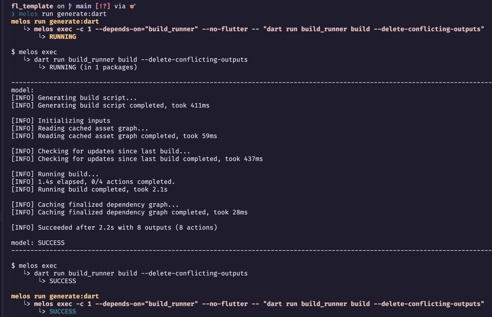
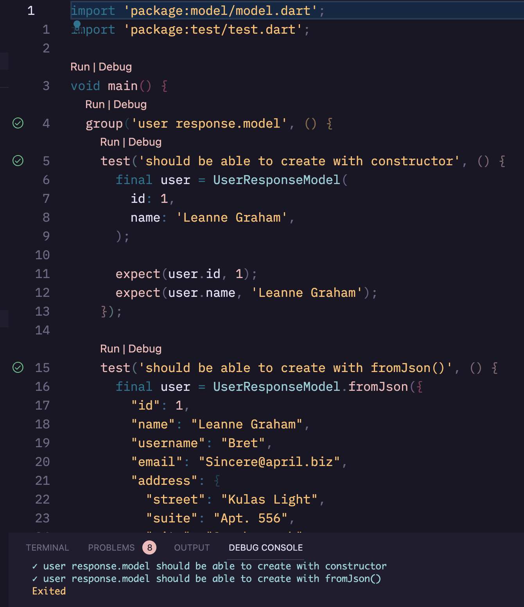
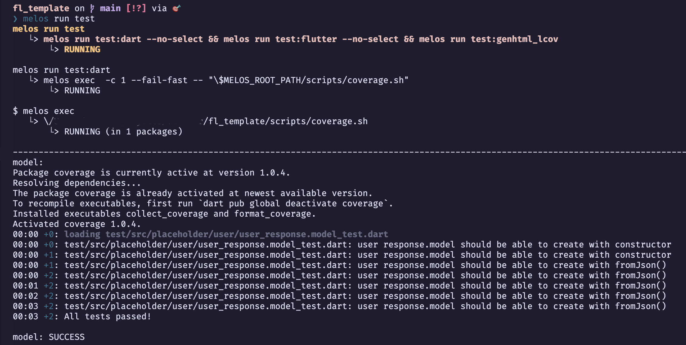

## Freezed Classes

To demonstrate converting of API responses in JSON to **[freezed](https://pub.dev/packages/freezed)** model classes, we're going to use [jsonplaceholder](https://jsonplaceholder.typicode.com/) user API as an example.

To define the [user](https://jsonplaceholder.typicode.com/users) type in the API as freezed model classes in Dart, 

- Create **model** dart files into the *packages/model* folder. *Please refer them in the folder including how to export with the barrel files.*

- Add following melos scripts to generate the model classes with [build_runner](https://pub.dev/packages/build_runner):
  
```yaml
  generate:
    run: melos run generate:dart && melos run generate:flutter
    description: Build all generated files for Dart & Flutter packages in this project.

  generate:dart:
    run: melos exec -c 1 --depends-on="build_runner" --no-flutter -- "dart run build_runner build --delete-conflicting-outputs"
    description: Build all generated files for Dart packages in this project.

  generate:flutter:
    run: melos exec -c 1 --depends-on="build_runner" --flutter -- "flutter pub run build_runner build --delete-conflicting-outputs"
    description: Build all generated files for Flutter packages in this project.
```

### Run the script to generate freezed model classes with **melos**:
```bash
melos run generate:dart
```



### Run the test from vscode and with **melos**:

- Test with VSCode:


- Add following melos scripts to test the model classes with **melos**.

```yaml
  test:
    run: melos run test:dart --no-select && melos run test:flutter --no-select && melos run test:genhtml_lcov
    description: Run all Dart & Flutter tests in this project.

  test:dart:
    run: melos exec  -c 1 --fail-fast -- "\$MELOS_ROOT_PATH/scripts/coverage.sh"
    description: Run Dart tests for a specific package in this project.
    select-package:
      flutter: false
      dir-exists: test

  test:flutter:
    run: melos exec --dir-exists="test" -c 1 --fail-fast -- "flutter test --coverage --exclude-tags=golden"
    description: Run Flutter tests for a specific package in this project.
    select-package:
      flutter: true
      dir-exists: test

  test:genhtml_lcov:
    run: melos exec --file-exists="coverage/lcov.info" -c 1 --fail-fast -- "genhtml coverage/lcov.info -o coverage"
    description: Generate line coverage report from lcov.info.

  test:golden:
    run: melos exec --dir-exists="test" -c 1 --fail-fast -- "flutter test --update-goldens --tags=golden"
    description: Run Flutter golden tests for a specific package in this project.
    select-package:
      flutter: true
      dir-exists: test
```


```bash
melos run test
```

