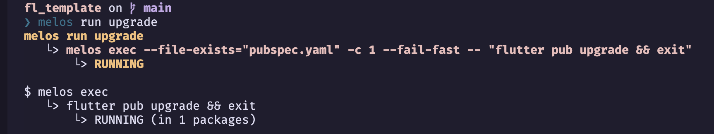
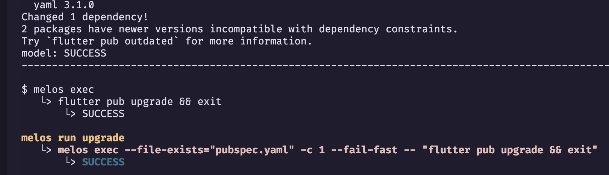

## Package Model

To have immutable **freezed** model classes,

- Create **model** package into the *packages* folder:

```bash
cd packages
flutter create --template=package model
```

- Edit **pubspec.yaml** of the model package:
  
```yaml
name: model
description: Model for fl_template
publish_to: none

version: 0.1.0

environment:
  sdk: ">=2.15.0 <3.0.0"

dependencies:
  freezed_annotation: ^1.1.0
  json_annotation: ^4.4.0

dev_dependencies:
  build_runner: ^2.1.7
  flutter_lints: ^1.0.4
  freezed: ^1.1.0
  json_serializable: ^6.1.2
  test: ^1.20.1
```

### Install the packages for the model package with **melos**:
```bash
melos run upgrade
```


