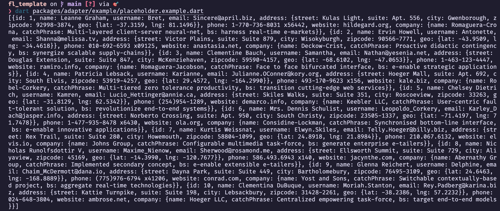
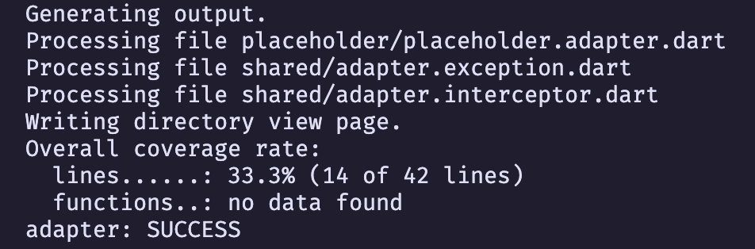

## Package Adapter

To have **[dio](https://pub.dev/packages/dio)** adapters,

- Create **adapter** package into the *packages* folder:

```bash
cd packages
flutter create --template=package adapter
```

- Edit **pubspec.yaml** of the adapter package:
  
```yaml
name: adapter
description: Adapter for fl_template
publish_to: none

version: 0.1.0

environment:
  sdk: ">=2.15.0 <3.0.0"

dependencies:
  flutter:
    sdk: flutter
    
  dio: ^4.0.4
  intl: ^0.17.0
  logger: ^1.1.0
  model:
    path: ../model

dev_dependencies:
  flutter_test:
    sdk: flutter

  flutter_lints: ^1.0.4
  http_mock_adapter: ^0.3.2
  test: ^1.19.5

```

### Install the packages for the model package with **melos**:
```bash
melos run upgrade
```

### PlaceHolderAdapter

- Create an adapter to call API, ie., for the JsonPlaceHolder API.

```dart
class PlaceHolderAdapter {
  late final String baseUrl;
  late final Dio _dio;

  PlaceHolderAdapter({
    required this.baseUrl,
    Dio? dio,
  }) {
    _dio = dio ?? Dio();
    _dio.interceptors.add(AdapterInterceptor());
  }

  // get users
  Future<Response<dynamic>> getUsers() {
    return _dio.get(
      '$baseUrl/users',
    );
  }

  // ignore: type_annotate_public_apis
  void close() {
    _dio.close();
  }
}
```

- To test out the adapter, create a CLI dart class to execute it, for example,



- Or write tests with [http_mock_adapter](https://pub.dev/packages/http_mock_adapter) then execute them from VSCode or with **melos run test**.

