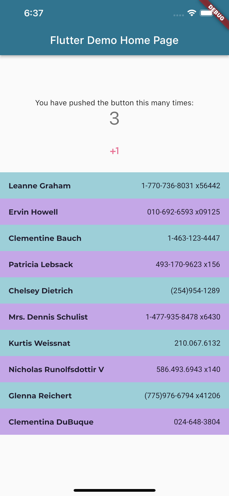
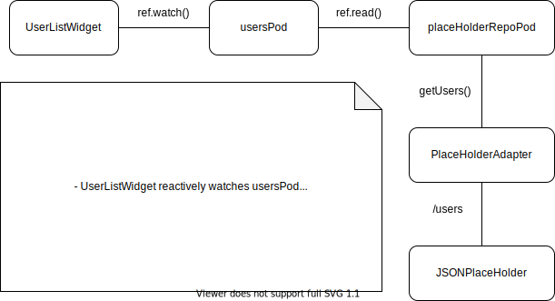

## Flutter Hooks / Riverpod

As running of the code committed with this markdown document, we can see this result.

Which consists of these two widgets:

- [Counter](../packages/ui/lib/widgets/counter.widget.dart)
- [User List](../packages/ui/lib/widgets/user_list.widget.dart) 

### Counter

  - Example of [Flutter Hooks](https://pub.dev/packages/flutter_hooks)
  - Counter's HookWidget refatored from StatefulWidget of Flutter skeleton
  - Using of Flutter Hooks is to increase code-sharing between widgets by removing duplicates.
  - There are existing hooks in the package so use them to simplify code.

### User List

  - Example of [Riverpod](https://pub.dev/packages/riverpod)
  - UserList's ConsumerWidget is to show how to wire a provider(*"userspod"*) to UI.
  - Using of Riverpod is the essense of this template app as example code listed below.
  - Study the package to use it properly. It has a learning curve.

- [Users Providers](../packages/ui/lib/pods/place_holder.pod.dart) 
- [PlaceHolder Repository](../packages/ui/lib/services/place_holder.repository.dart)
- [PlaceHolder Adapter](../packages/adapter/lib/src/placeholder/placeholder.adapter.dart)
- [User Response Model](../packages/model/lib/src/placeholder/user/user_response.model.dart)

*Next, we'll add app's declarative routes with **go_router**. Stay tuned for more!*
