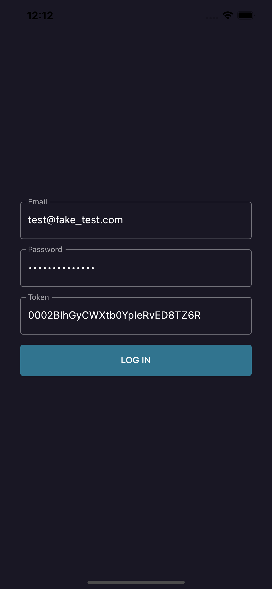
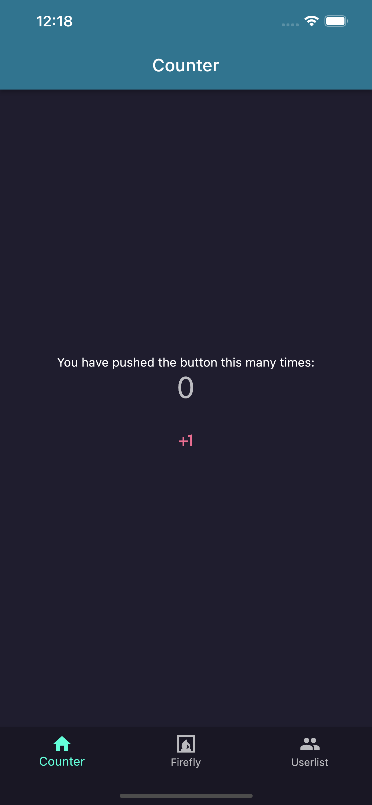
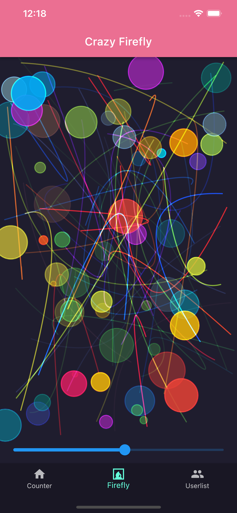
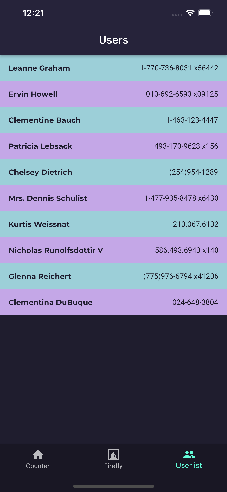
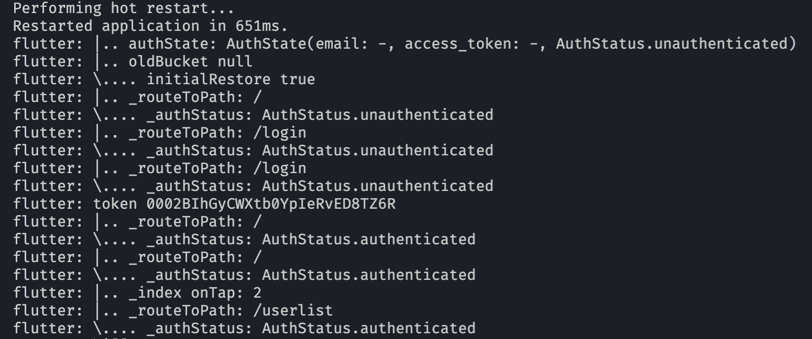

## Go Router

As running of the code committed with this markdown document, we can see these pages to demonstrate declarative routes with **[go_router](https://pub.dev/packages/go_router)**.

| Login | Counter | Firefly | Users |
| ----- | ------- | ------- | ----- |
|  |  |  |  |

### Design ideas of routes in app

  - All routes used in app declared in one place, [**appRouter**](../packages/ui/lib/app.router.dart)

    
        
  - **appRouter** is attached to MaterialApp.router as router provider. 
  - So **go_router** can use it with GoRouteInformationParser and GoRouteDelegate.
  - Routing with **go_router** is just easy and simple as passing route paths, [**router helper**](../packages/ui/lib/shared/router.helper.dart).
  - [**CURRENT_PAGE**](../packages/ui/lib/constants/current_page.enum.dart) is to help checking of routing related data integrity in easier way.
  - Login Page and related providers in the pods folder are just to demonstrate how to handle routes for unauthenticated and authenticated.
  - Those state and viewmodel classes with [**equatable**](https://pub.dev/packages/equatable) are just this template app's naming convention and used as hand-writing model class for specific purpose.
  
  
